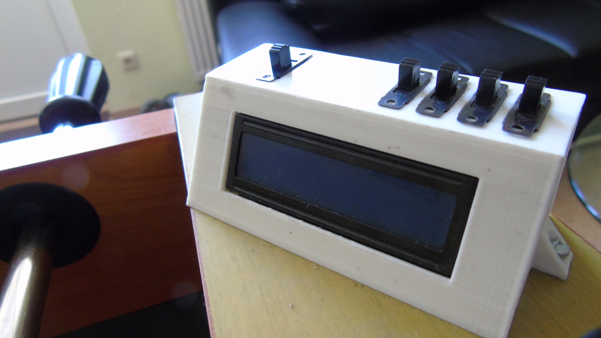
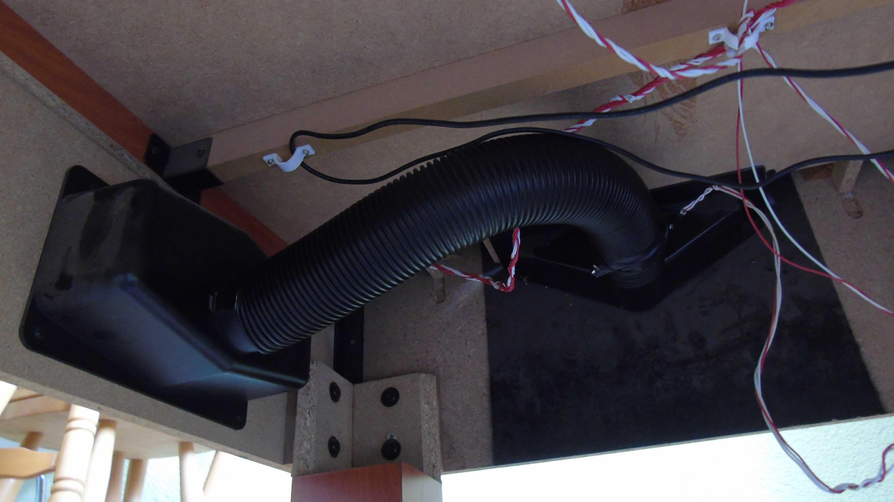
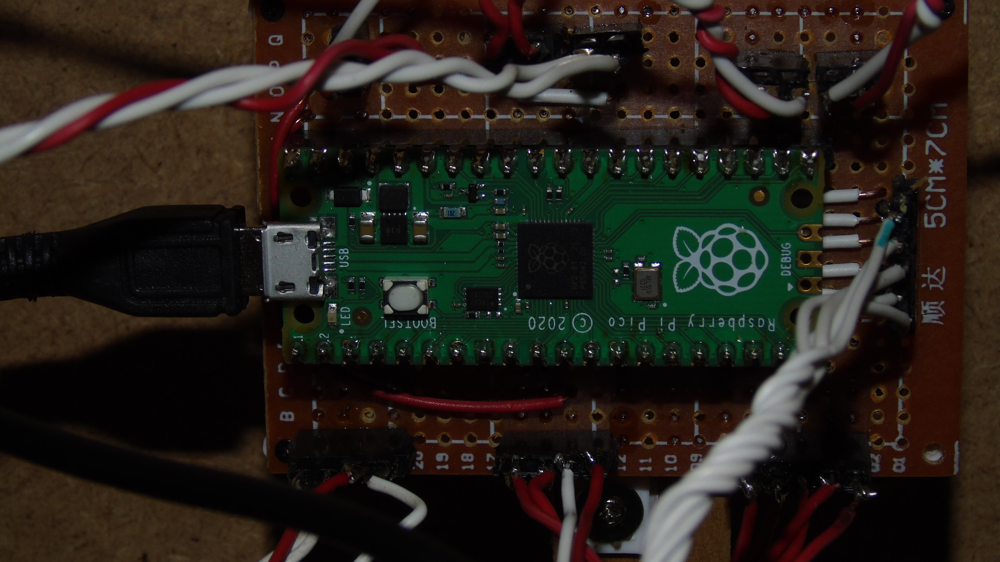

<h1>Automatischer Tischkicker</h1>

1 <a href="https://github.com/Zananz/Automatischer-Tischkicker#beschreibung">Beschreibung</a> 
2 <a href="https://github.com/Zananz/Automatischer-Tischkicker#funktionsweise">Funktionsweise</a> 
3 <a href="https://github.com/Zananz/Automatischer-Tischkicker#anleitung">Anleitung</a> 

<h2>Beschreibung</h2>

Ein umgebauter Tischkicker welcher in der Lage ist Tore
automatisch zu zählen und Spielstände von bis zu 16 Spielern zu
Speichern. 

<h2>Funktionsweise</h2>

Der umgebaute Tischkicker verfügt über 2 Terminals mit jeweils
einem 2x16LCD-Display und 5 Schaltern. 4 der 5 Schalter dienen zur
Eingabe der Spieler-ID (ein max. vierstelliger Binärwert (0=0000,
1=0001 usw.)(daher 16 Spieler)), der verbleibende Schalter dient zum
bestätigen der ID.  Des weiten verfügt der Tischkicker über 2 rote
Buttons welche auf der jeweiligen Seite ein Tor (Punkt) abziehen.

Tore werden mit Hilfe von Lichtschranken an der Ballführung
zwischen Tor und Ballausgabe gezählt.

Zur Ansteuerung der Komponenten wird ein Raspberry Pi pico verwendet welcher mit einer 3D-gedruckten <a href = "https://github.com/Zananz/Automatischer-Tischkicker/blob/main/3D-Modele/Halterung%20Platine.stl">Halterung</a> an der Unterseite des Tischkickers befestigt ist.

<h2>Anleitung</h2>
