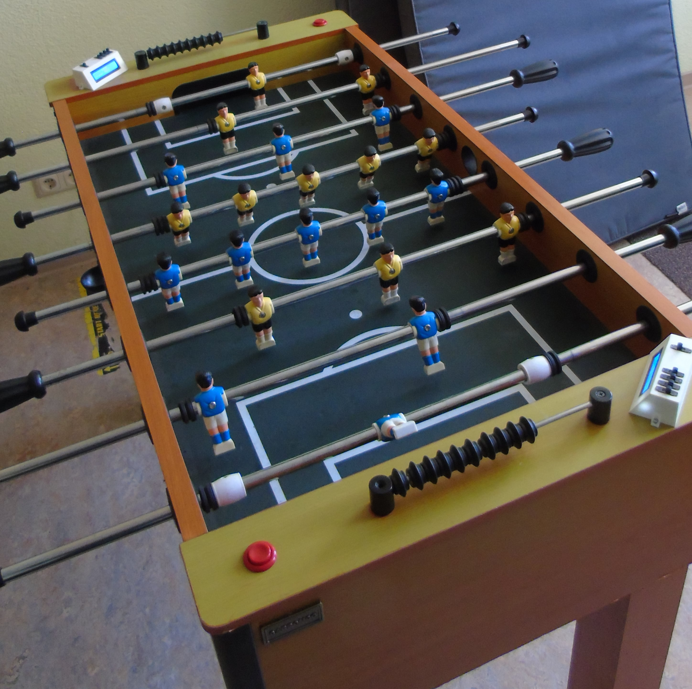

<h1>Automatischer Tischkicker</h1>

1. <a href="https://github.com/Zananz/Automatischer-Tischkicker#beschreibung">Beschreibung</a> 
2. <a href="https://github.com/Zananz/Automatischer-Tischkicker#funktionsweise">Funktionsweise</a> 
3. <a href="https://github.com/Zananz/Automatischer-Tischkicker#anleitung">Anleitung</a> 

<h2>Beschreibung</h2>

Ein umgebauter Tischkicker welcher in der Lage ist Tore
automatisch zu zählen und Spielstände von bis zu 16 Spielern zu
Speichern.

<h2>Funktionsweise</h2>

Der umgebaute Tischkicker verfügt über 2 Terminals mit jeweils
einem 2x16LCD-Display und 5 Schaltern. 4 der 5 Schalter dienen zur
Eingabe der Spieler-ID (ein max. vierstelliger Binärwert (0=0000,
1=0001 usw.)(daher 16 Spieler)), der verbleibende Schalter dient zum
bestätigen der ID.  Des weiten verfügt der Tischkicker über 2 rote
Buttons welche auf der jeweiligen Seite ein Tor (Punkt) abziehen.

Tore werden mit Hilfe von Lichtschranken an der Ballführung
zwischen Tor und Ballausgabe gezählt.

Zur Ansteuerung der Komponenten wird ein Raspberry Pi pico verwendet welcher mit einer 3D-gedruckten <a href = "https://github.com/Zananz/Automatischer-Tischkicker/blob/main/3D-Modele/Halterung%20Platine.stl">Halterung</a> an der Unterseite des Tischkickers befestigt ist.

<h2>Anleitung</h2>
<h3>Hardware</h3>
<h4>Benötigt</h4>

&nbsp;&nbsp;&nbsp;&nbsp;1. <a href="https://www.reichelt.de/de/de/raspberry-pi-pico-rp2040-cortex-m0-microusb-rasp-pi-pico-p295706.html?PROVID=2788&gclid=Cj0KCQjw5uWGBhCTARIsAL70sLJZmWKXHrvFUepyNmBNkdQq6oy-H902bFISH3mzTY8U6nheLmrltdcaAk_PEALw_wcB&&r=1">Raspberry Pi pico</a> 
&nbsp;&nbsp;&nbsp;&nbsp;2. <a href="https://www.ebay.de/itm/353136370982?_trkparms=aid%3D1110002%26algo%3DSPLICE.SOI%26ao%3D1%26asc%3D232959%26meid%3D17ccc1449bfd4c81a873386502849afa%26pid%3D101196%26rk%3D1%26rkt%3D12%26sd%3D353187914842%26itm%3D353136370982%26pmt%3D1%26noa%3D0%26pg%3D2047675%26algv%3DPromotedSellersOtherItemsV2WithMLRv3&_trksid=p2047675.c101196.m2219&amdata=cksum%3A35313637098217ccc1449bfd4c81a873386502849afa%7Cenc%3AAQAGAAACAKuqBdasenSZkhYEh9RaiJYvGkEfNnbGMrV26sVGA9Ny67MuxizaHrKsm8ySrqm6aCtRB%252BvvoT5l3eoU6fa05gt4BSjBjMw7ck4od81Jn8lTAx3eZ3lK%252B1MQ9S2JVCVeh7rP9xBuNoeFK%252BfXDn%252F7oWvXh7OZ4ycmXcdnZ%252FbdIptAPyyFW9gga2ZVR0bNjWgRco3FRwM5s7E6jfWSV1iBfS2J4XmYaRyY3HheX1I2VfBsLb2u04E1Ac039gxYAPz8Bb%252BFjFH8K8SgAFDExoeOwpQXZJaE6z1leza1qBYpF8zwZBA9ifAjpWiGFC0J%252FFDMKbvS%252BDEnHyZQxojdmyImcTcq7rTVxuY%252BLIhmMTEMs8DpTrjd7LvcCAXGHZHnpaZp7daRGFsWucp7BAPdPxIc9PEGxYzUTZGCyXxTQ4EiRKQJQJ2Wgp6560MjvmgXb6MTfpzMivLNViCLDye%252Fu38YDv%252FvnpbiEW%252FXt9Fv%252FQDMuNeucS9ON16BSmqTRrlpC0P8Kjft3fIHdvSMwd%252BRuRJZQ%252F30aQW2WsMaWnrIsUIXEQMSte8s8DqCCdjJeOwdbotvA8KsEdCQ7mFaD5K6gYLIBhytDdeNuYBhB%252FwwptXbmpnx1TogJe0vry4TD4fShxDQpmt0em10%252BzUHvRoT%252Fs6dmbvXPpoo2j4xAjFQeFfAGnXd%7Campid%3APL_CLK%7Cclp%3A2047675">2x 5V Laserdiode 6mm Ø</a> 
&nbsp;&nbsp;&nbsp;&nbsp;3. <a href="https://www.ebay.de/itm/272853994103?chn=ps&mkevt=1&mkcid=28">2x Fotowiederstand</a> 
&nbsp;&nbsp;&nbsp;&nbsp;4. <a href="https://www.ebay.de/itm/353160204184?mkevt=1&mkcid=1&mkrid=707-53477-19255-0&campid=5338364437&customid=353160204184_12576&toolid=11000">2x 16x2 LCD-Display + I2C Controller </a> 
&nbsp;&nbsp;&nbsp;&nbsp;5. <a href="https://www.ebay.de/itm/333602388391?ssPageName=STRK%3AMEBIDX%3AIT&_trksid=p2060353.m2749.l2649">10x Schalter</a> 
&nbsp;&nbsp;&nbsp;&nbsp;6. <a href="https://www.reichelt.de/arcade-button-mit-mikrostaster-rot-arc-button-rd-p225319.html?PROVID=2788&gclid=Cj0KCQjw5uWGBhCTARIsAL70sLJVQ4KVxEaYdbZvQqt8TTKTVURrjntogCm4_aFAXm4QZtlTiLIYugQaAh4OEALw_wcB">2x Button 33mm Ø</a> 
&nbsp;&nbsp;&nbsp;&nbsp;7. M3 Schrauben (4x 5mm, 4x ca.50mm), 4 Muttern 
&nbsp;&nbsp;&nbsp;&nbsp;8. <a href="https://www.ebay.de/itm/174035126580?chn=ps&mkevt=1&mkcid=28">Pin Header Male</a>, <a href="https://www.ebay.de/itm/174252775416?chn=ps&mkevt=1&mkcid=28">Pin Header Female</a> 
&nbsp;&nbsp;&nbsp;&nbsp;9. <a href="https://www.ebay.de/itm/323649063851?chn=ps&mkevt=1&mkcid=28">50 x 70 mm Lochraster 2,54 mm Platine</a> 

<h4>Verkablung</h4>
<table>
  <tr>
    <th>Pico Pin</th><th>LCD Spieler-1</th>
  </tr>
  <tr>
    <td>GND</td><td>GND</td>
  </tr>
  <tr>
    <td>V_BUS</td><td>V</td>
  </tr>
  <tr>
    <td>6</td><td>sda</td>
  </tr>
  <tr>
    <td>7</td><td>scl</td>
  </tr>
  <tr>
    <th>Pico Pin</th><th>LCD Spieler-2</th>
  </tr>
  <tr>
    <td>GND</td><td>GND</td>
  </tr>
  <tr>
    <td>V_BUS</td><td>V</td>
  </tr>
  <tr>
    <td>0</td><td>sda</td>
  </tr>
  <tr>
    <td>1</td><td>scl</td>
  </tr>
  <tr>
    <th>Pico</th><th>Lichtschranke Spieler-1 (siehe <a href="https://github.com/Zananz/Automatischer-Tischkicker#laserschranken">hier</a>)</th>
  </tr>
  <tr>
    <td>GND</td><td>GND</td>
  </tr>
  <tr>
    <td>3V3</td><td>3.3V</td>
  </tr>
  <tr>
    <td>ADC 0</td><td>Data</td>
  </tr>
  <tr>
    <th>Pico</th><th>Lichtschranke Spieler-2 (siehe <a href="https://github.com/Zananz/Automatischer-Tischkicker#laserschranken">hier</a>)</th>
  </tr>
  <tr>
    <td>GND</td><td>GND</td>
  </tr>
  <tr>
    <td>3V3</td><td>3.3V</td>
  </tr>
  <tr>
    <td>ADC 1</td><td>Data</td>
  </tr>
  <tr>
    <th>Pico Pin</th><th>Button Spieler-1</th>
  </tr>
  <tr>
    <td>V_BUS</td><td>Anschluss 1</td>
  </tr>
  <tr>
    <td>16</td><td>Anschluss 2</td>
  </tr>
  <tr>
    <th>Pico Pin</th><th>Button Spieler-2</th>
  </tr>
  <tr>
    <td>V_BUS</td><td>Anschluss 1</td>
  </tr>
  <tr>
    <td>17</td><td>Anschluss 2</td>
  </tr>
  <tr>
    <th>Pico Pin</th><th>Spielereingabe Spieler-1</th>
  </tr>
  <tr>
    <td>V_BUS</td><td>COM an allen Schaltern (SPDT)</td>
  </tr>
  <tr>
    <td>12</td><td>Schalter 1</td>
  </tr>
  <tr>
    <td>13</td><td>Schalter 2</td>
  </tr>
  <tr>
    <td>14</td><td>Schalter 3</td>
  </tr>
  <tr>
    <td>15</td><td>Schalter 4</td>
  </tr>
  <tr>
    <td>11</td><td>Schalter 5 (Login-Schalter)</td>
  </tr>
  <tr>
    <th>Pico Pin</th><th>Spielereingabe Spieler-2</th>
  </tr>
  <tr>
    <td>V_BUS</td><td>COM an allen Schaltern (SPDT)</td>
  </tr>
  <tr>
    <td>4</td><td>Schalter 1</td>
  </tr>
  <tr>
    <td>3</td><td>Schalter 2</td>
  </tr>
  <tr>
    <td>2</td><td>Schalter 3</td>
  </tr>
  <tr>
    <td>8</td><td>Schalter 4</td>
  </tr>
  <tr>
    <td>5</td><td>Schalter 5 (Login-Schalter)</td>
  </tr>
</table>
<h4>Laserschranke</h4>

Die Lichtschranke besteht aus einer 3D-gedruckten Schelle in welche eine Laserdiode und ein Fotowiederstand geklebt wird. Diese liegen sich so gegenüber, dass der von der Diode ausgehende Lichtstrahl auf den Fotowiederstand trifft. Die Schelle wird so am Führungsschlauch des Balls angebracht, dass die für den Laser und den Fotowiederstand zu bohrenden Löcher den Ball nicht beim rollen behindern. 
Der Schaltplan für die Schranke:

Wobei S_1 in der <a href="https://github.com/Zananz/Automatischer-Tischkicker#verkablung">Verkablungsübersicht</a> für Data (bei Butten Spieler-1) steht.(S_2 = Spieler-2)

<h4>Bau</h4>

Terminal: 
&nbsp;&nbsp;&nbsp;&nbsp;1. Ausdruckern der Bauteile: <a href="https://github.com/Zananz/Automatischer-Tischkicker/blob/main/3D-Modele/Tischkicker_Station.stl">Station</a>, <a href="https://github.com/Zananz/Automatischer-Tischkicker/blob/main/3D-Modele/Abdeckung.stl">Abdeckung</a> 
&nbsp;&nbsp;&nbsp;&nbsp;2. Einbauen der LCD-Display und der Schalter. (Verkabeln nach <a href="https://github.com/Zananz/Automatischer-Tischkicker#verkablung">Verkablungsübersicht</a>) 

Allgemein:
Alle Bauteile anbringen wie im Bild zu sehen. Mehr Bilder <a href="https://github.com/Zananz/Automatischer-Tischkicker/tree/main/Bilder">hier</a>. 
Zum bohren der Löcher für die Buttons wird ein 28mm Bohrer benätigt. Da die Terminals mit 2 M3 Schrauben befestigt werden wird ein 3,5mm Bohrer benötigt. Zu empfehlen ist weiterhin ein 10mm Bohrer zum bohren von Kabeldurchführungen an den Terminals.

Um den Pico auf der Platine an der Unterseite des Tischkickers zu befestigen wird eine 3D-gedruckte <a href="https://github.com/Zananz/Automatischer-Tischkicker/blob/main/3D-Modele/Halterung%20Platine.stl">Halterung</a> benötigt. 
Um den Pico mit Strom zu Versorgen ist es nicht ratsam dierekt mit einem USB-Kabel von einem Netzteil in der Steckdose an den USB-Eingang des Picos zu gehen, da es leit zu einem Defekt an diesem kommen kann wenn bspw. am Kabel gezogen wird. Es ist Empfehlenswert einen SStoßabfänger einzubauen. In diesem Fall ein an die Seitenwand geklebtes 12V DC Netzteil an welches ein 5V USB-Stepdown-Converter angeschlossen ist. Dies hat mehrere Vorteile zum einen wird zug am Kabel so am Netzteil "abgefangen" zum anderen besteht die Möglichkeit sein Smarphone am Tischkicker zu Laden.

Sind alle Bauteile angebracht und Verkabelt, ist der Bau abgeschlossen.

<h3>Software</h3>

Alle .py Dateien aus dem Repo müssen auf den Pico gepielt werden. 
Es muss ein Ordner "Spielstände" auf dem Pico erstellt werden. Ist dies geschehen muss Spielstände_auf_0.py ausgeführt werden. Wurde das Skript ausgeführt sollten im Ordner "Spielstände" Textdateien im Muster "4ställigeBinärzahl-4ställigeBinärzahl.txt" vorzufinden sein. Ist dies der Fall ist der Tischkicker einsatzbereit. Bei ausführung von main.py (starten des Picos) wird das Programm zur steuerung des Tischkickers ausgeführt.

